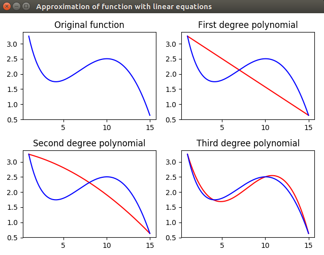
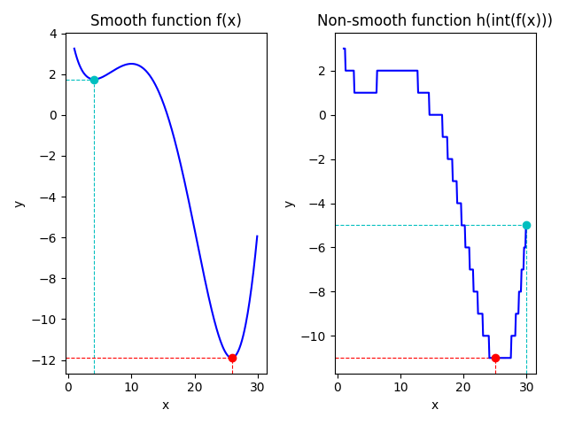

# Machine Learning in Python
Implementing Machine Learning algorithms and techniques in Python.
<br/>[](https://doi.org/10.5281/zenodo.1345027)

### Reference to:
Valentyn N Sichkar. Machine Learning in Python // GitHub platform. DOI: 10.5281/zenodo.1345027

### Related works:
* Sichkar V.N. Comparison analysis of knowledge based systems for navigation of mobile robot and collision avoidance with obstacles in unknown environment. St. Petersburg State Polytechnical University Journal. Computer Science. Telecommunications and Control Systems, 2018, Vol. 11, No. 2, Pp. 64–73. DOI: <a href="https://doi.org/10.18721/JCSTCS.11206" target="_blank">10.18721/JCSTCS.11206</a>

* The study on image processing in Python is put in separate repository and is available here: https://github.com/sichkar-valentyn/Image_processing_in_Python

* The study of Neural Networks for Computer Vision in autonomous vehicles and robotics is put in separate repository and is available here: https://github.com/sichkar-valentyn/Neural_Networks_for_Computer_Vision

## Description
Practical experiments on Machine Learning in Python. Processing of sentences and finding relevant ones, approximation of function with polynomials.

## Content
Codes (it'll send you to appropriate file):
* [Processing_Sentences](https://github.com/sichkar-valentyn/Machine_Learning_in_Python/tree/master/Codes/Processing_Sentences.py)
* [Function_Approximation](https://github.com/sichkar-valentyn/Machine_Learning_in_Python/tree/master/Codes/Function_approximation.py)
* [Function_Optimization](https://github.com/sichkar-valentyn/Machine_Learning_in_Python/tree/master/Codes/Function_Optimization.py)

<br/>
Experimental results (figures and tables on this page):

* <a href="#Processing sentences and finding cosine distances">Processing sentences and finding cosine distances</a>
* <a href="#Approximation of functions via linear equations">Approximation of functions via linear equations</a>
* <a href="#Optimization of smooth and non-smooth functions">Optimization of smooth and non-smooth functions</a>

<br/>

### <a name="Processing sentences and finding cosine distances">Processing sentences and finding cosine distances</a>
Implementing the task about processing sentences. Finding cosine distances between first sentence and all others. For implementation a two-dimensional matrix is created, where rows are sentences (objects) and columns are words (properties).
<br/>Matrix is filled with numbers that corresponds to number of times every word (property) were met in every sentence. Then, after matrix was built, distances are calculated between first vector (row) and all others. Calculation is done with the help of **'scipy.spatial.distance.cosine'** function.
<br/><br/>Part of the code is shown below with a lot of comments:

```py
from scipy.spatial.distance import cosine

# Calculating cosine distances between first sentence and all others
# Writing result into new dictionary
# Indexes of sentences are keys and distances are values
# Also, writing result into list, that will help to find two minimums
d = {}
lst_distances = []
for i in range(1, len(a)):
    c = cosine(a[0, :], a[i, :])
    d[i] = c
    lst_distances += [c]

# Finding two sentences with closest distances to the first one
# Sorting the list with the method 'sort()'
lst_distances.sort()  # All elements are sorted now by increasing

# Finding keys from the dictionary that are corresponds to two first elements from the list
result_1 = list(d.keys())[list(d.values()).index(lst_distances[0])]
result_2 = list(d.keys())[list(d.values()).index(lst_distances[1])]

print(result_1, result_2)  # Number of closest sentences
print(d)

```

As a result, dictionary is obtained with number of sentence as a key (from number 1) and distance to the very first sentence (number 0):
<br/>{1: 0.9527544408738466, 2: 0.8644738145642124, 3: 0.8951715163278082, 4: 0.7770887149698589, 5: 0.9402385695332803, 6: 0.7327387580875756, 7: 0.9258750683338899, 8: 0.8842724875284311, 9: 0.9055088817476932, 10: 0.8328165362273942, 11: 0.8804771390665607, 12: 0.8396432548525454, 13: 0.8703592552895671, 14: 0.8740118423302576, 15: 0.9442721787424647, 16: 0.8406361854220809, 17: 0.956644501523794, 18: 0.9442721787424647, 19: 0.8885443574849294, 20: 0.8427572744917122, 21: 0.8250364469440588}

Then, two closest sentences to the 0-numbered sentence were found as a result.

Full code is available here: [Processing_Sentences.py](https://github.com/sichkar-valentyn/Machine_Learning_in_Python/tree/master/Codes/Processing_Sentences.py)

<br/>

### <a name="Approximation of functions via linear equations">Approximation of functions via linear equations</a>
Implementing the task for approximation of function with linear equations. Using first degree polynomial, second degree polynomial and third degree polynomial. Solving equations with matrix method via **'numpy.linalg.solve(a, b)'** function.

Initial function is as following:
<br/>**f(x) = sin(x / 5) * exp(x / 10) + 5 * exp(-x / 2)**

Points for first degree polynomials are: **1, 15**
<br/>Points for second degree polynomials are: **1, 8, 15**
<br/>Points for third degree polynomials are: **1, 4, 10, 15**
<br/><br/>Part of the code is shown below with a lot of comments:

```py
import numpy as np


# Creating first degree polynomials in the points of 1 and 15
# It has to be in following form:
# w_0 + w_1 * x_1 = y_1
# w_0 + w_1 * x_2 = y_2
# Writing systems of equations into two-dimensional array 'a' and vector 'b'
a = np.array([[1, 1], [1, 15]])
b = np.array([f(1), f(15)])  # [3.25221687 0.63522142]

# Solving system of linear equations for first degree polynomial
w = np.linalg.solve(a, b)  # [ 3.43914511 -0.18692825]
# Found equation for the first degree polynomial is as following:
# y = w[0] + w[1] * x

```

Full code is available here: [Function_approximation.py](https://github.com/sichkar-valentyn/Machine_Learning_in_Python/tree/master/Codes/Function_approximation.py)

Results are plot in order to understand the quality of approximation in eache case. Figure is shown below:



<br/>

### <a name="Optimization of smooth and non-smooth functions">Optimization of smooth and non-smooth functions</a>
Implementing the task for finding minimum of given smooth and non-smooth functions. Using **scipy.optimaze** library and two methods - **BFGS** and **differential evolution**.

Initial **smooth** function is as following (the same as it is in approximation task above):
<br/>**f(x) = sin(x / 5) * exp(x / 10) + 5 * exp(-x / 2)**

Finding minimum of **smooth** function with **'BFGS'** method with start point **2**
<br/>Part of the code is shown below:
```py
# Setting initial point in form of 'ndarray' as 'minimize' function requires it in form of 'ndarray'
x0_start = np.array([2])
# print(type(x))  -->  <class 'numpy.ndarray'>
# print(x.shape)  -->  (1,)
# Finding minimum of the function from starting point 'x_start = 2'
# Using 'minimize' function from 'scipy.optimize' library
y0_min = optimize.minimize(f_array, x0_start, method='BFGS')
print(y0_min)  # fun = 1.7452682903449388, iterations = 6
```

<br/>Finding minimum of **smooth** function with **'BFGS'** method with start point **30**
<br/>Part of the code is shown below:
```py
# Setting initial point in form of 'ndarray' as 'minimize' function requires it in form of 'ndarray'
x1_start = np.array([30])
# print(type(x))  -->  <class 'numpy.ndarray'>
# print(x.shape)  -->  (1,)
# Finding minimum of smooth function from starting point 'x_start = 30'
# Using 'minimize' function from 'scipy.optimize' library
y1_min = optimize.minimize(f_array, x1_start, method='BFGS')
print(y1_min)  # fun = -11.898894665981285, iterations = 6 
```

<br/>Finding minimum of **smooth** function with **'differential evolution'** method in range [1, 30]
<br/>Part of the code is shown below:
```py
# Setting the range for searching in form of tuple inside list as function requires it
x2_range = [(1, 30)]  # tuple inside list
# Finding minimum of smooth function
y2_min = optimize.differential_evolution(f_array, [(1, 30)])
print(y2_min)  # fun = -11.89889467, iterations = 5
```

<br/>Initial **non-smooth** function is takeen as an integer results of smooth function defined above: **h(x) = int(f(x))**
<br/>Part of the code is shown below:
```py
# By using 'np.int_' we return 'numpy.ndarray' of integer numbers
def h_array(k):
    return np.int_(f_array(k))
```

<br/>Finding minimum of **non-smooth** function with **'BFGS'** method with start point **30**
<br/>Part of the code is shown below:
```py
# Setting initial point in form of 'ndarray' as 'minimize' function requires it in form of 'ndarray'
x3_start = np.array([30])
# print(type(x))  -->  <class 'numpy.ndarray'>
# print(x.shape)  -->  (1,)
# Finding minimum of the function from starting point 'x_start = 30'
# Using 'minimize' function from 'scipy.optimize' library
y3_min = optimize.minimize(h_array, x3_start, method='BFGS')
print(y3_min)  # fun = -5, iterations = 0
```

<br/>Finding minimum of **non-smooth** function with **'differential evolution'** method in range [1, 30]
<br/>Part of the code is shown below:
```py
# Setting the range for searching in form of tuple inside list as function requires it
x4_range = [(1, 30)]  # tuple inside list
# Finding minimum of smooth function
y4_min = optimize.differential_evolution(h_array, [(1, 30)])
print(y4_min)  # fun = -11.0, iterations = 3
```

<br/>Full code is available here: [Function_Optimization.py](https://github.com/sichkar-valentyn/Machine_Learning_in_Python/tree/master/Codes/Function_Optimization.py)

Results are plot in order to understand the difference in finding minimums in smooth and non-smooth functions. Figure is shown below:



<br/>

### MIT License
### Copyright (c) 2018 Valentyn N Sichkar
### github.com/sichkar-valentyn
### Reference to:
Valentyn N Sichkar. Machine Learning in Python // GitHub platform. DOI: 10.5281/zenodo.1345027
